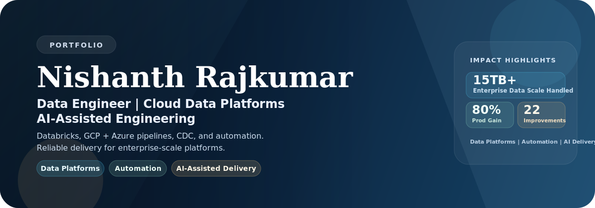

  

  
  
  

---

### Snapshot

I build cloud data platforms and integration systems that move enterprise data reliably across GCP and Azure, with strong depth in Databricks-based engineering.

My core focus areas:
- ETL/ELT architecture and CDC patterns
- Data pipeline reliability, observability, and automation
- Distributed data engineering with Databricks and Spark ecosystems
- AI-assisted engineering workflows for faster, safer delivery

### Featured Initiative

**AI-integrated BigQuery SDLC — a repo-first operating model**

Self-driven initiative at Ashley to make AI pair-programming safely usable on a warehouse platform that had *no native repo support and zero margin for unreviewed change*.

- **Problem.** AI-first SDLC was accelerating API/UI/backend teams, but BigQuery had no native or third-party way to live in a Git repo — the very context AI tools need. Leadership had legitimate concerns about AI touching databases where changes are not as reversible as code.
- **Approach.** Exported BigQuery into a repo via `INFORMATION_SCHEMA` (tables, views, routines, functions → SQL + parallel JSON metadata in GCS), authored RFC-2119 style AI standards (naming, audit columns, formatting, JOIN discipline, documentation), and built a human workflow that forbids direct DDL — every structural change flows through feature branch → PR review → generated change script with data-migration steps → deployment by named BigQuery owners. `main-dev` mirrors dev GCP; release branches into `main` mirror prod.
- **Outcome.** Representative use cases dropped from **~5 days to 1–2 days** for my team. Endorsed by leadership and **now the reference pattern other Ashley teams follow for their databases**. Human accountability preserved at the PR gate by design, not policy. Currently evolving toward CI/CD on PR merge while keeping the PR-level human gate intact.

> Stack: BigQuery · GCS · Augment Code · Git · GitHub PRs · INFORMATION_SCHEMA · PowerShell · JSON schemas

### At A Glance

| Area | Summary |
|---|---|
| Role Focus | Data Engineering, Cloud Data Platforms, Integration-heavy Delivery |
| Core Cloud | GCP, Azure, Databricks |
| Data Scale | 15TB+ enterprise workloads |
| Delivery Impact | 80% productivity gain, 11 POCs beyond target, 22 improvements |

### Currently Building

- GCP data pipelines with BigQuery, Cloud Functions, Dataflow, and Databricks
- Cross-cloud data integration across Azure and GCP
- Metadata-driven delivery patterns for repeatable platform work

### Databricks Expertise

- Spark-based data engineering for scalable ETL/ELT processing
- Delta-oriented data workflows for reliability and maintainability
- Performance-aware pipeline design across storage, compute, and scheduling
- Integration of Databricks workloads with broader Azure and GCP data platforms

### Signature Wins

| Metric | Outcome |
|---|---|
| 80% | Productivity gain from AI-assisted workflows |
| 11 | POCs delivered beyond target |
| 22 | Process improvements implemented |
| 15TB+ | Enterprise data scale handled |

  Recognized with the Dirty Fingernail Award (2025) and Above and Beyond Award of the Quarter (Q4 2025).

### Featured Work

**[TripAdvisor-Reviews-Analysis-AZURE](https://github.com/NishanthRajkumar/TripAdvisor-Reviews-Analysis-AZURE)**  
Problem: Build a robust sentiment-analysis pipeline with analytics-ready outputs.  
Built: Azure solution using Synapse Analytics, Data Lake, Data Warehouse, Power BI, and Azure ML.  
Stack: Synapse | Data Lake | Data Warehouse | Power BI | Azure ML

**[Azure-RealTime-Twitter-Data](https://github.com/NishanthRajkumar/Azure-RealTime-Twitter-Data)**  
Problem: Capture and process social signals in near real time.  
Built: Streaming workflow using Python, Azure Functions, Event Hub, and Stream Analytics.  
Stack: Python | Azure Functions | Event Hub | Stream Analytics

**[CosmosDB-BooksLibrary-API](https://github.com/NishanthRajkumar/CosmosDB-BooksLibrary-API)**  
Problem: Deliver a practical API with cloud-native data persistence patterns.  
Built: Python service with Cosmos DB-backed data operations.  
Stack: Python | API Design | Cosmos DB

> Additional enterprise platform work is available on request where code is private or team-owned.

### Case Highlights

- Pipeline Reliability Upgrade
Problem: Cross-platform data flow had preventable operational friction.
Action: Standardized integration patterns and reliability-focused pipeline design.
Outcome: Enabled high-volume delivery at 15TB+ enterprise data scale.

- AI-Assisted Delivery Enablement
Problem: Engineering cycles were slower than business demand.
Action: Introduced practical AI-assisted workflows into day-to-day engineering delivery.
Outcome: Achieved 80% productivity gain and accelerated execution.

- Continuous Improvement Drive
Problem: Multiple delivery bottlenecks reduced throughput.
Action: Targeted process and automation enhancements across delivery lifecycle.
Outcome: Implemented 22 measurable process improvements and exceeded POC targets by 11.

### Tech Stack

**Cloud and Data:** GCP, Azure, Databricks, BigQuery, Dataflow, ADF, Synapse, Fabric, Logic Apps, Function Apps  
**Languages and Runtime:** Python, C#, .NET, SQL, KQL, PySpark  
**Engineering and Delivery:** Web APIs, Hangfire, Power BI, Agile/Scrum, stakeholder collaboration

### Engineering Principles

- Reliability first: build for failure handling, retries, and observability
- Business aligned: prioritize measurable impact and maintainable systems
- Fast iteration: use AI-assisted workflows while keeping quality gates clear

### Now And Next

**Now:** Building robust cross-cloud data pipelines with Databricks-enabled engineering patterns.  
**Next:** Solving larger platform-scale data and integration challenges with measurable business impact.

### GitHub Signals

### Currently Exploring

Agentic engineering workflows, metadata-driven pipelines, and practical patterns for AI-enabled data operations.

### What I Can Help With

- Building scalable cloud data pipelines across GCP and Azure
- Designing CDC and integration-first enterprise data workflows
- Productionizing Databricks and Spark-based engineering solutions
- Improving delivery velocity through automation and AI-assisted workflows

### Open To

Data Engineering and Cloud Data Platform roles focused on integration-heavy, high-impact delivery.

### Reach Me

[Email](mailto:nishrk97@outlook.com) | [LinkedIn](https://www.linkedin.com/in/nishanthrajkumar) | [GitHub](https://github.com/NishanthRajkumar)
